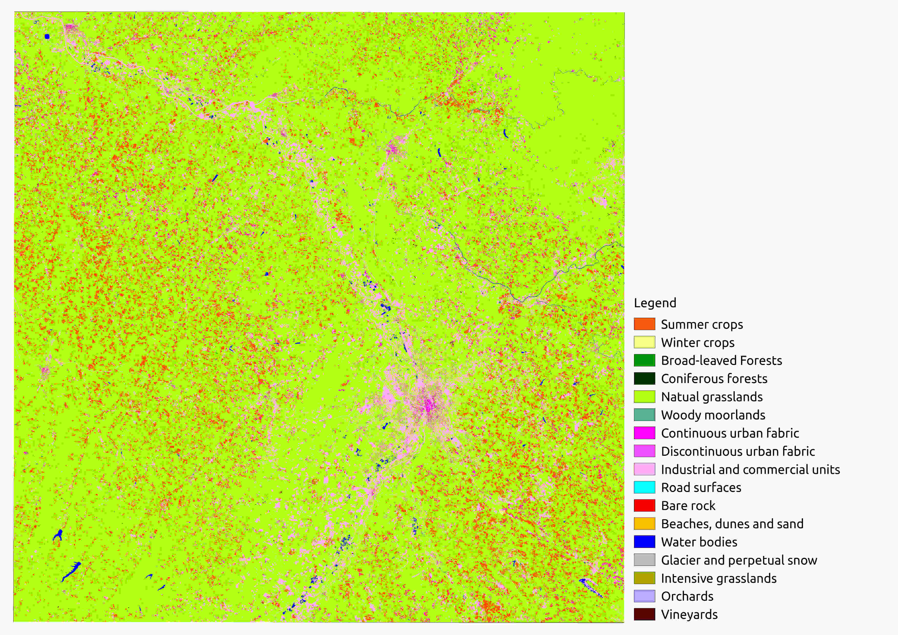
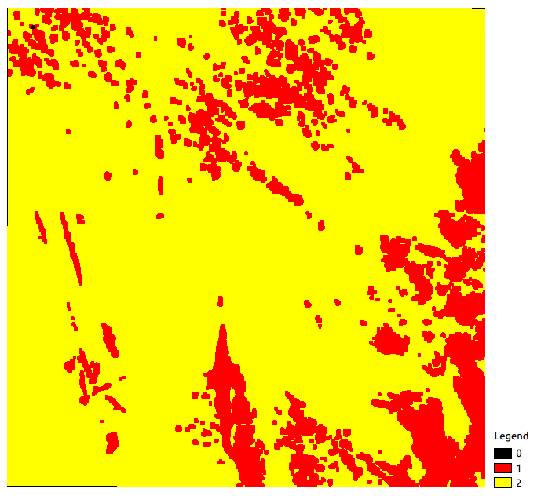
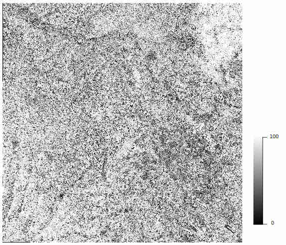
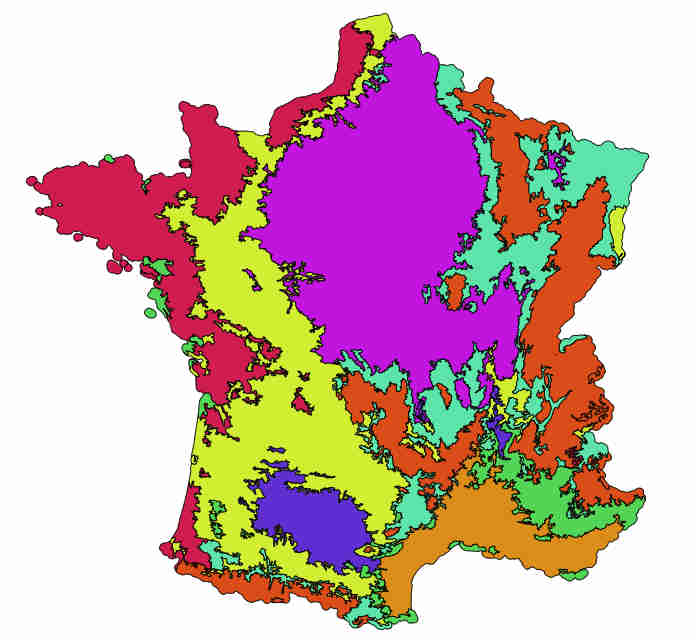
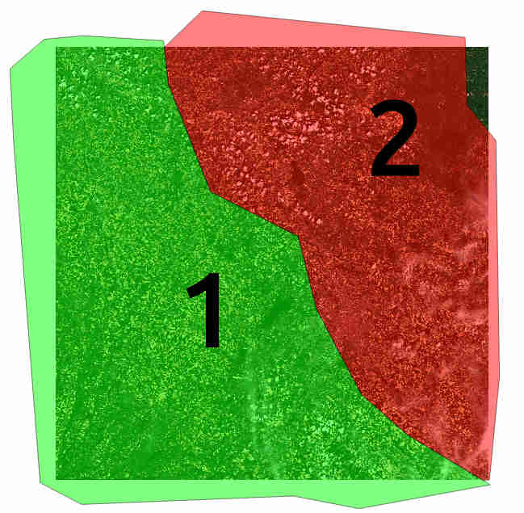
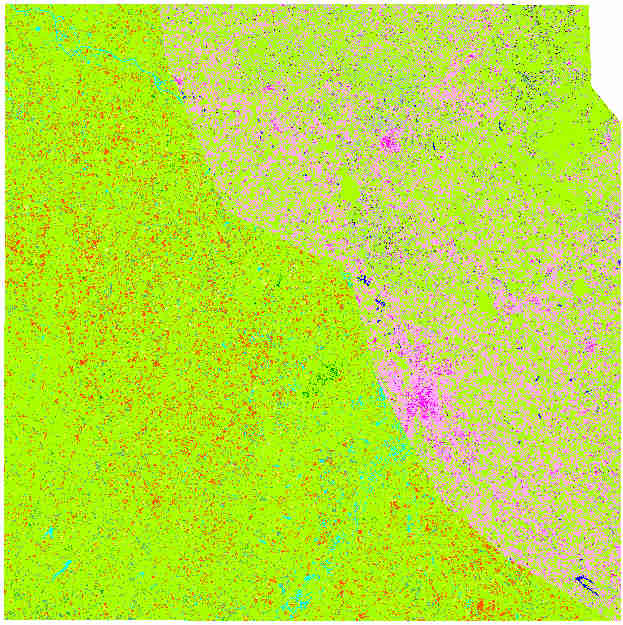

IOTA² use cases
###############

Assuming IOTA² is :doc:`fully operational <HowToGetIOTA2>` , this section will present some IOTA² use cases.
Users could re-produce presented outputs by using the downloadable `data-set <http://osr-cesbio.ups-tlse.fr/echangeswww/TheiaOSO/IOTA2_TEST_S2.tar.bz2>`_ .

First try with IOTA² ? :ref:`first-contact`

You have two distinct regions to classify ? :ref:`two-zones`

.. _first-contact:

IOTA² first contact
*******************

The purpose of this example is to provide to users a fully detailed step by step of how to launch IOTA² on a simple data-set.
A zone that covers a full Sentinel-2 tile will be classified using a ground truth which contains 13 different classes.

Get the data-set
================

Download the data-set `here <http://osr-cesbio.ups-tlse.fr/echangeswww/TheiaOSO/IOTA2_TEST_S2.tar.bz2>`_ (4Go).
This archive contains sensors data (two sentinel-2 dates) available on THEIA's `website <https://theia.cnes.fr/atdistrib/rocket/#/search?collection=SENTINEL2>`_ and other IOTA²'s inputs:

Archive's description:

.. code-block:: console

    ├── colorFile.txt
    ├── IOTA2_Example.cfg
    ├── IOTA2_Outputs
    │   └── Results
    │       └── #IOTA2's output (according to the configuration file)
    ├── nomenclature.txt
    ├── sensor_data
    │   ├── T31TCJ
    │   │   ├── SENTINEL2A_20180511-105804-037_L2A_T31TCJ_D_V1-7
    │   │   │   ├── MASKS
    │   │   │   │   └── *.tif
    │   │   │   └── *.tif
    │   │   └── SENTINEL2A_20180521-105702-711_L2A_T31TCJ_D_V1-7
    │   │       ├── MASKS
    │   │       │   └── *.tif
    │   │       └── *.tif
    │   └── T31TDJ
    │       └── #empty
    └── vector_data
        ├── EcoRegion.shp
        └── groundTruth.shp

``colorFile.txt`` : color table.

.. code-block:: console

    cat colorFile.txt
    ...
    10 255 85 0
    ...

Here the class **10** has the **RGB** color **255 85 0**.

``nomenclature.txt`` : label's name.

.. code-block:: console

    cat colorFile.txt
    ...
    prairie:211
    ...
    
.. Warning:: Each class must be represented in colorFile.txt and nomenclature.txt

``sensor_data`` : the directory which contains Sentinel-2 data. These data **must** be stored by tiles as in the archive.

``groundTruth.shp`` : the shapeFile containing geo-referenced and labelized polygons (no multi-polygons, no overlapping) used to learn a model.

``EcoRegion.shp`` : shapeFile containing two geo-referenced polygons.

``IOTA2_Example.cfg`` : the file which set IOTA²'s parameters as inputs/outputs paths, classifier parameters etc...

Edit IOTA² configuration file
=============================

A configuration file is a simple text file containing sections and fields.

Example :

.. code-block:: python

    First_section:
    {
        First_section_field_1:"value"
        First_section_field_2:10
    }
    Second_section:
    {
        Second_section_field_1:"value"
        ...
        MyAwesome_field:10
    }

To be able to run the chain, you have to replace ``XXXX`` in ``IOTA2_Example.cfg`` by the path where you download 
the provided archive. Also replace the ``MyInstall`` by the path where IOTA² is downloaded.

.. Note:: ``IOTA2_Example.cfg`` is the minimal configuration file understandable by IOTA².

Launch IOTA²
============

First, you have to set a list of environement variables to inform IOTA² "where is OTB".
The file ``prepare_env.sh`` do it for you. Then use ``Iota2.py`` to launch the chain.

.. code-block:: console

    source /MyInstall/iota2/scripts/install/prepare_env.sh
    python /MyInstall/iota2/scripts/Iota2.py -config /absolutePath/to/IOTA2_Example.cfg

IOTA² is launched, it will print all processing steps to obtain classifications and their validations:

.. code-block:: console

    Full processing include the following steps (checked steps will be run): 
    Group init:
         [x] Step 1: create directories
         [x] Step 2: generate common masks
         [x] Step 3: compute validity mask by tile
    Group sampling:
         [x] Step 4: generate envelopes
         [x] Step 5: generate region shapes
         [x] Step 6: Prepare samples
         [x] Step 7: merge samples by models
         [x] Step 8: generate samples statistics
         [x] Step 9: select samples
         [x] Step 10: generate samples
         [x] Step 11: merge samples
    Group dimred:
    Group learning:
         [x] Step 12: learning
    Group classification:
         [x] Step 13: generate classification commands
         [x] Step 14: generate classifications
    Group mosaic:
         [x] Step 15: classfication shaping
    Group validation:
         [x] Step 16: confusion matrix command generation
         [x] Step 17: generate confusion matrix
         [x] Step 18: confusion matrix fusion
         [x] Step 19: report generation

Afterward, it prints the current step until the end of the chain is reached.

.. code-block:: console

    Running step 1: create directories (1 tasks)
    Running step 2: generate common masks (1 tasks)
    ...
    some prints
    ...
    Running step 3: compute validity mask by tile (1 tasks)
    ...

**Let's have a look at IOTA²'s outputs.**

You will find them in the directory specified in field ``outputPath`` into the configuration file.
IOTA² generates a lot of temporary data which could help users to analyse classification's results. 
For example, IOTA² keeps sample's label with associated features which feed the classification model. You could find these
data in the directory ``learningSamples``.

Final results are stored in the ``final`` directory. In it you could find ``Classif_Seed_0.tif`` as final classification.
Also, ``Classif_Seed_0_ColorIndexed.tif`` corresponds to the same image but colorized in order to be easily visualized.

A report is also available next to final classifications : ``RESULTS.txt``. It summurizes classification quality.
It contains a verbose confusion matrix and coefficients computed from it  : Kappa, OA, Precision, Recall, F-score by class.

**Outputs rasters**

Your *Classif_Seed_0.tif* should looks like this one.

    
    Classif_Seed_0.tif Example

This map contains labels from the shapeFile ``groundTruth.shp``. As you can see the classification is bad.
A possible explanation is the low number of dates used to produce it. A raster called ``PixelsValidity.tif`` gives for each pixel 
how many times the pixel is clear (no cloud, cloud's shadow, saturation)

    
    PixelsValidity.tif Example

As only two dates are used to produce the classification map, pixels are in the [0; 2] range. IOTA² also provides a confidence map : ``Confidence_Seed_0.tif`` which
could participate to better understand the resulting classification. This map gives a percentage for each pixels telling how much the classification system is sure about it's choice.

    
    Confidence_Seed_0.tif Example

These three maps form IOTA²'s main outputs: they are the minimum outputs required to analyse and understand the classifications' results.

We analyzed and produced classifications thanks to IOTA². The main objectif is to get the better classification map as 
possible. There are many ways to achieve this purpose: researchers publish every day new methods.

The simplest method to get better results can consist in using a larger time serie, filling-up the learning data. 

Improve your classification
===========================

1. Download new dates from `THEIA <https://theia.cnes.fr/atdistrib/rocket/#/search?collection=SENTINEL2>`_.
These data are zipped, unzip them next to the ones already present in the directory ``T31TCJ`` in ``sensor_data``.

.. Note:: To get less interpolated dates, you should pick-up dates near the ones already used : 2018-05-11 and 2018-05-21. **Every** date placed in ``sensor_data`` will be used.

2. Re-launch IOTA²

.. code-block:: console

    source /MyInstall/iota2/scripts/install/prepare_env.sh
    python iota2/scripts/Iota2.py -config /absolutePath/to/IOTA2_Example.cfg

.. Warning::
    The previous run is stored in the directory ``Results``.
    In order to **not overwrite** this directory, **you must** change the field ``outputPath`` in ``IOTA2_Example.cfg``.
    Or create a new configuration file.

Expand your classification
==========================

IOTA² allows the management of many tiles to produce classifications. If you want to classify more than one tile, 
you have to create a new directory by tile. One is already created in ``sensor_data`` : ``T31TDJ`` which is empty.
As before, you could download dates and unzip them in the corresponding directory.

.. Warning::
    Do not forget to add the tile in the field ``listTile`` of the configuration file. 

    .. code-block:: python
    
        listTile:'T31TCJ T31UDP'

.. _two-zones:

Multi regions
*************

You could provide to IOTA² a shapeFile describing different learning regions. Each polygons contains 
a label referencing the region it belongs to. In the archive there is the shape ``EcoRegion.shp`` containing two regions.

**What is it used for ?**

If the area to be classified is big enough, a given class may have different phenological cycles.
Modelizing regions where phenological cycles are almost homogeneous for most of classes
and attribute to each a didicated model, could improve the quality of classifications.
To classify the entire french country, we used the following region distribution
(more details about the national product `here <http://www.mdpi.com/2072-4292/9/1/95>`_).

    
    France regions

How to set it in the configuration file ?
=========================================

As already explained the region shape must contain a field to descriminate regions.
Let's have a look at the shape ``EcoRegion.shp``

    
    Region shape Example

There are two regions, region "1" and "2" (field ``region``) which cover almost a full Sentinel-2 tile.
Two models will be constructed: the first one will use polygons of ``groundTruth.shp`` under the green region, while
the second model will use polygons under the red region.

.. Note:: Each model will classify **only** its learning region.

.. Warning:: There must not be overlapping between polygons in the regions shape.

In order to use the region file add these fields to your configuration file :

.. code-block:: python
    
        chain:
        {
        ...
        regionPath:'/XXXX/IOTA2_TEST_S2/EcoRegion.shp'
        regionField:'region'
        ...
        }

Here is the example of configuration file :download:`configuration <./config/config_MultiRegions.cfg>`

IOTA²'s outputs with regions
============================

Every IOTA² run follow the same workflow but could generate different outputs.
In this particular run, IOTA² generated two models (in the ``model`` directory).
Each model is used to classify its region as show below :

+--------------------------------------------------+--------------------------------------------------+
| .. figure:: ./Images/classification_region1.jpg  | .. figure:: ./Images/classification_region2.jpg  |
|   :alt: classication region 1                    |   :alt: classication region 2                    |
|   :scale: 50 %                                   |   :scale: 50 %                                   |
|   :align: center                                 |   :align: center                                 |
|                                                  |                                                  |
|   classification of region 1                     |   classification of region 2                     |
+--------------------------------------------------+--------------------------------------------------+

Then these two raster are merged and constitute the final classification.

    
    Classif_Seed_0.tif Multi regions Example

.. Note:: you could noticed that the right-top corner is not classified. It's because this area does not belong to any models.

