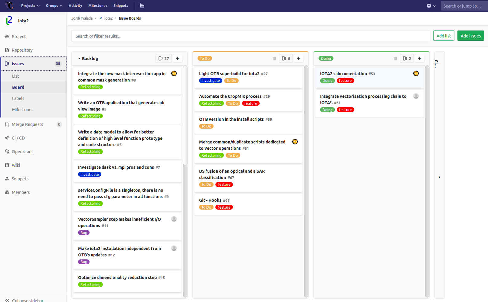

Development recommendations
###########################

GIT 
***

IOTA² development uses `GIT <https://git-scm.com>`_ as source control tool.

GIT-Flow
========

There are many ways of using GIT. In IOTA² ``git-flow`` has been chosen to maintain the project (**without release branches**).
You can find more about it `here <https://jeffkreeftmeijer.com/git-flow/>`_.

To roughly sum-up, for the development of a new feature, the developer **must** :

   1. from ``develop``, create a feature ``branch``
   2. ``commit`` often
   3. ``merge`` new features comming from the ``develop`` branch into the feature branch
   4. when the feature is ready, create a ``merge request`` into the develop branch.

Branch naming conventions
=========================

+-----------------------+-------------------+------------------------------------------+
| branch purpose        | naming convention | Example                                  |
+=======================+===================+==========================================+
| develop a new feature | feature-*         | feature-Classsifications_fusion          |
+-----------------------+-------------------+------------------------------------------+
| respond to an issue   | issue-*           | issue-#53_Improve_Classifications        |
+-----------------------+-------------------+------------------------------------------+
| fix a bug             | fix-*             | fix-#27_Bug                              |
+-----------------------+-------------------+------------------------------------------+

the ``#27`` in *fix-#27_Bug* should refer to an issue reported on `IOTA² GIT repository <https://framagit.org/inglada/iota2/issues>`_.

FRAMAGIT
********

IOTA² is hosted on `FramaGit <https://framagit.org/inglada/iota2>`_ .
Anybody can create an account for **free** and submit merge requests. To monitor the project, 
`issues <https://framagit.org/inglada/iota2/issues>`_ are mainly used. Developments are often started by a 
reported issue describing a bug, a new interesting feature or a research idea.

Issues
======

If a developer wants to contribute to IOTA², here is the recommended workflow:

   1. If an issue about the new feature does not exist, create a dedicated one.
   2. Assign the issue to herself.
   3. When the contribution is done, close the issue.

Theses simple rules will avoid duplicate work between developers.

.. Note::
    The Board view is very useful to see which features are in development, need to be developed, or are in the backlog.

    
    Board view

TESTS
*****

Unittest
========

IOTA² is mainly developed in Python, and the `Unittest <https://docs.python.org/2.7/library/unittest.html>`_ library has been chosen
to implement our unit test framework. It is ``highly recommended`` adding tests to each new feature.
Currently, unit tests are placed in the ``/iota2/scripts/Tests/UnitTests`` directory.

Baselines
=========

A set of baseline data is already present in ``/iota2/data/references``. Please use them as references to your tests.
If new baseline must be created, add it in the directory previously quoted after discussion and consensus among the development team.

.. Warning::
    Baselines must be as small as possible.
