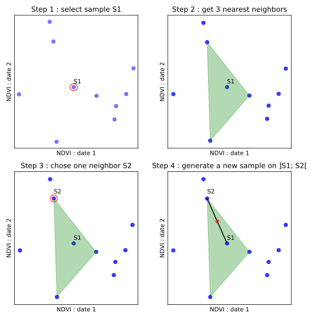

Sample Augmentation method explain
##################################

Three methods are available to generate synthetic samples : :ref:`ReplicateMethod`,
:ref:`JitterMethod` and :ref:`SMOTEMethod`

.. _ReplicateMethod:

Replicate
*********

This is the simplest method. **N** new samples are generated by duplicating **N**
samples already present in the sample set.

.. _JitterMethod:

Jitter
******

New samples are generated by adding gaussian noise to input samples which are
randomly selected with replacement.

.. _SMOTEMethod:

SMOTE
*****

This section summarizes the :abbr:`SMOTE (Synthetic Minority Over-sampling Technique)`
algorithm using an illustrarion. The fully explanation about the SMOTE method used
in IOTA² is available `here <https://jair.org/index.php/jair/article/view/10302>`_.

The figure below shows the generation of ``one sample`` using ``3 neighbors``:

    
    SMOTE algorithm

These 4 steps are repeated to generate as many samples as needed.
Thanks to the use of neighbors, noise generation is less important than the jitter
method. The higher the number of neighbors, the lower the noise.

